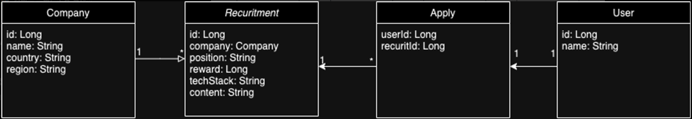
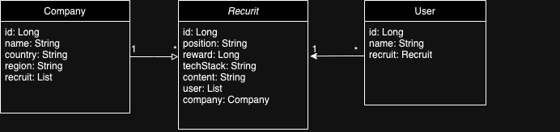

# wanted-pre-onboarding-backend
wanted pre-onboarding backend

### 요구사항 분석

#### Recruit: 채용공고 도메인
    채용공고의 경우, 총 7가지 동작을 수행해야합니다.

    1. 채용공고_등록 : 등록하는 회사의 ID와 추가 필드의 데이터를 기반으로 채용공고 데이터를 작성합니다. 

    2. 채용공고_수정 : 등록되어 있는 데이터에 접근하여 새로운 입력으로 데이터를 수정합니다.
                    (데이터 전체가 아닌 일부만으로도 수정 가능)

    3. 채용공고_삭제 : 삭제 동작시 데이터베이스에서 영속성을 지웁니다.

    4. 채용공고_조회 : 데이터 조회시 단건 데이터 및 목록 조회를 각각 동작하도록 설정합니다.

    5. 채용공고_조회_상세 : 기존 데이터 조회 동작에 일부 데이터를 추가 조회합니다. 

    6. 채용공고_검색 : url에 파라미터로 넘겨지는 keyword를 통해 포함된 데이터만 조회합니다.

    7. 채용공고_지원 : 기존 존재하는 채용공고에 UserId를 기준으로 user의 정보를 받아 저장합니다.
    
#### user: 사용자 도메인
    1. 사용자_조회 : 등록되어 있는 사용자 데이터에 대해서 조회합니다.
    
 
#### company: 회사 도메인
    1. 회사_조회 : 등록되어 있는 회사 데이터에 대해서 조회합니다.

#### 도메인 모델과 테이블 설계
    요구사항 분석을 토대로 임시로 만든 엔티티에 대한 관계도(테이블 설계)를 했습니다.
")

#### 도메인 모델 수정
    작업 중 지원이라는 모델은 필요하지 않은 것 같아서 삭제후 관계를 다시 정리 했습니다.

### 구현 순서

#### 1. Domain 엔티티 구현
    - 사용자 데이터로 사용할  Users (User는 겹쳐서 s붙여 생성) 객체 생성
    - 회사 데이터로 사용할 Company 객체 생성
    - 채용공고 데이터를 사용할 Recruit 객체 생성

#### 1-1 초기 데이터 추가
    등록 및 생성 로직을 사용하지 않고, 서비스 단계의 로직들을 체크하기 위해 임시 데이터들을 
    프로젝트 시작시 입력이 되도록 추가했습니다.

#### 2. 객체를 저장할 Repository 구현
    구현된 Entity의 데이터를 저장하는 동작을 할 Repository를 구현했습니다.
    EntityManager를 통해 영속성을 제어하여 데이터를 등록 및 삭제, 조회를 합니다.

#### 3. 동작을 수행할 Service 구현
    Repository를 접근하여 요구사항에 포함된 동작들을 수행하는 로직을 만들었습니다.

#### 3-1. Service Test 추가 
    실제 Service 동작들이 의도한대로 결과를 돌출하는지 테스트를 통해 검증하였습니다.

#### 4. API url을 맵핑하는 Controller 구현
    HTTP 메서드에 따른 적절한 결과값을 return 하기 위해 url을 맵핑하는 동작을 수행할 Controller를 만들었습니다.
    같은 URL이어도 HTTP 메서드에 따라 동작이 달라집니다.

#### 4-1. DTO 구현
    메서드 별 요구사항에 부합하는 JSON 데이터 형식이 다르므로 DTO 구현을 통해 필요에 따라
    다른 형식의 데이터를 return 할 수 있도록 구현하였습니다.

#### 4-2. Controller Test 추가
    Controller에서 맵핑한 URL에 따른 동작들이 적절한지 검증하는 Test를 추가하였습니다.

